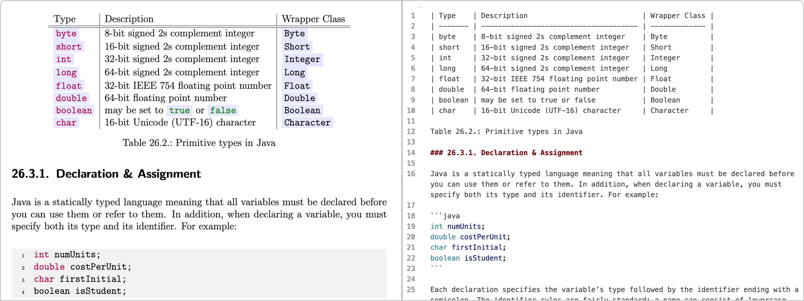

# Custom Zerox OCR

## Custom Zerox OCR

A dead simple way of OCR-ing a document for AI ingestion with support for custom API endpoints. Documents are meant to be a visual representation after all. With weird layouts, tables, charts, etc. The vision models just make sense!

The general logic:

- Pass in a file (PDF, DOCX, image, etc.)
- Convert that file into a series of images
- Pass each image to your custom API and ask nicely for Markdown
- Aggregate the responses and return Markdown

## Features

- **Custom API Support**: Use any OpenAI-compatible API endpoint
- **Multiple Providers**: Support for OpenAI, Azure OpenAI, AWS Bedrock, Google Gemini, and custom APIs
- **PDF Processing**: Convert PDFs to images and process them
- **Image Processing**: Direct image OCR support
- **Concurrent Processing**: Process multiple pages simultaneously
- **Format Maintenance**: Maintain consistent formatting across pages

## Installation

### Prerequisites

- Install **poppler** on your system. See the [pdf2image documentation](https://pdf2image.readthedocs.io/en/latest/installation.html) for instructions by platform.

### Install Custom Zerox

`ash
pip install custom-zerox
`

## Usage

### Basic Usage with Custom API

`python
import asyncio
from py_zerox import zerox

async def main():
    # Using custom API endpoint
    result = await zerox(
        file_path="path/to/your/document.pdf",
        model="gpt-4-vision-preview",  # Your model name
        api_url="https://one.api4gpt.com/v1/chat/completions",  # Your API endpoint
        api_key="your-api-key",  # Your API key
        max_tokens=400,  # Optional: max tokens
    )
    
    print(result)

if __name__ == "__main__":
    asyncio.run(main())
`

### Using with Traditional Providers

`python
import asyncio
from py_zerox import zerox
import os

async def main():
    # OpenAI
    os.environ["OPENAI_API_KEY"] = "your-openai-key"
    result = await zerox(
        file_path="path/to/document.pdf",
        model="gpt-4o-mini"
    )
    
    # Azure OpenAI
    os.environ["AZURE_API_KEY"] = "your-azure-key"
    os.environ["AZURE_API_BASE"] = "https://your-endpoint.openai.azure.com"
    result = await zerox(
        file_path="path/to/document.pdf",
        model="azure/gpt-4o-mini"
    )
    
    # Google Gemini
    os.environ["GEMINI_API_KEY"] = "your-gemini-key"
    result = await zerox(
        file_path="path/to/document.pdf",
        model="gemini/gpt-4o-mini"
    )

if __name__ == "__main__":
    asyncio.run(main())
`

## API Reference

### Custom API Parameters

When using a custom API endpoint, you can pass the following parameters:

- **api_url** (str, required): The API endpoint URL
- **api_key** (str, optional): API key for authentication
- **headers** (dict, optional): Additional headers for the request
- **model** (str, required): Model name to use in the API call
- **max_tokens** (int, optional): Maximum tokens to generate (default: 400)

### General Parameters

- **file_path** (str): Path to the PDF file to process
- **model** (str): Model to use for generating completions
- **cleanup** (bool, optional): Whether to cleanup temporary files (default: True)
- **concurrency** (int, optional): Number of concurrent processes (default: 10)
- **maintain_format** (bool, optional): Maintain format across pages (default: False)
- **output_dir** (str, optional): Directory to save markdown output
- **temp_dir** (str, optional): Directory for temporary files
- **custom_system_prompt** (str, optional): Custom system prompt
- **select_pages** (list, optional): Specific pages to process

## Custom API Format

The custom API should accept requests in the following format:

`json
{
  "model": "gpt-4-vision-preview",
  "stream": false,
  "messages": [
    {
      "role": "user",
      "content": [
        {
          "type": "text",
          "text": "这张图片有什么"
        },
        {
          "type": "image_url",
          "image_url": {
            "url": "data:image/png;base64,{base64_image}"
          }
        }
      ]
    }
  ],
  "max_tokens": 400
}
`

And return responses in this format:

`json
{
  "choices": [
    {
      "message": {
        "content": "Generated markdown content"
      }
    }
  ],
  "usage": {
    "prompt_tokens": 100,
    "completion_tokens": 50
  }
}
`

## Supported File Types

- PDF (Portable Document Format)
- DOC, DOCX (Microsoft Word)
- ODT, OTT (OpenDocument Text)
- RTF (Rich Text Format)
- TXT (Plain Text)
- HTML, HTM (HTML Document)
- XML (XML Document)
- XLS, XLSX (Microsoft Excel)
- ODS, OTS (OpenDocument Spreadsheet)
- CSV, TSV (Comma/Tab Separated Values)
- PPT, PPTX (Microsoft PowerPoint)
- ODP, OTP (OpenDocument Presentation)

## Example Output

`python
ZeroxOutput(
    completion_time=9432.975,
    file_name='document',
    input_tokens=36877,
    output_tokens=515,
    pages=[
        Page(
            content='# Document Title\n\nThis is the converted markdown content...',
            content_length=1234,
            page=1
        )
    ]
)
`

## Error Handling

The library provides comprehensive error handling:

- **FileUnavailable**: When the input file cannot be accessed
- **MissingEnvironmentVariables**: When required environment variables are missing
- **ModelAccessError**: When there's an issue accessing the model
- **NotAVisionModel**: When the specified model doesn't support vision

## Development

### Building from Source

`ash
git clone https://github.com/your-username/custom-zerox.git
cd custom-zerox
pip install -e .
`

### Running Tests

`ash
pytest py_zerox/tests/
`

## License

This project is licensed under the MIT License.

## Contributing

Contributions are welcome! Please feel free to submit a Pull Request.

## Credits

- [Litellm](https://github.com/BerriAI/litellm): Powers the Python SDK to support all popular vision models
- Original Zerox project for the base implementation
